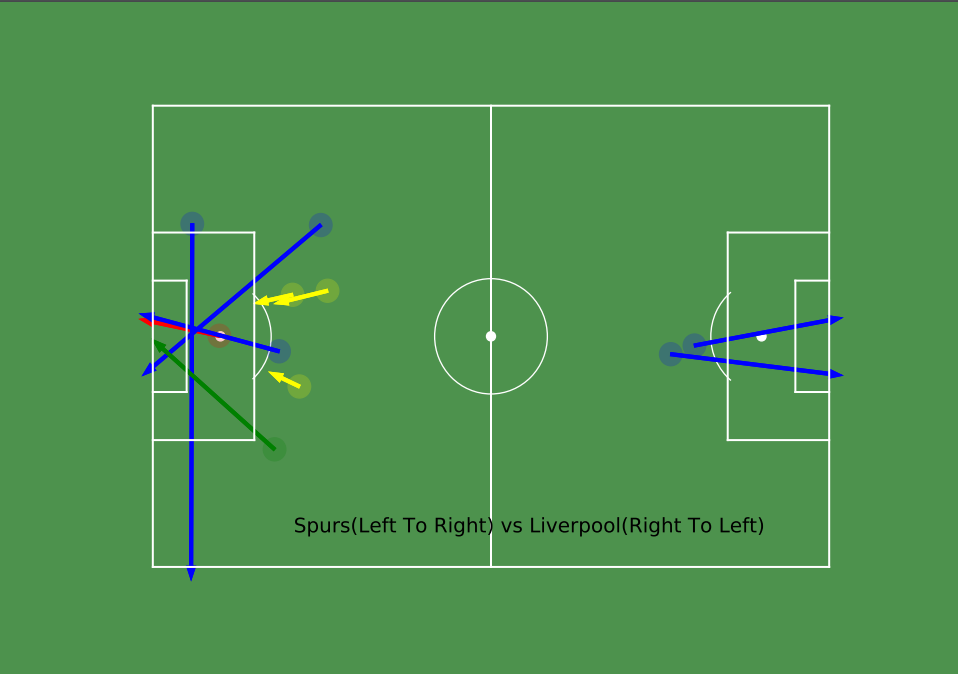
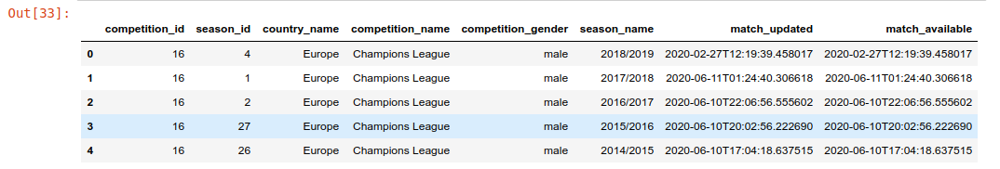

## Eng goal :
* This is what we want to achieve at the end of this article:

* Colors for shot type:

1. goal : red
2. saved : green
3. blocked : yellow
4. yellow: wayward try




## Data Source :

`Note` : The data has been provided freely by Statsbomb .For further information ,go to their website to read the user agreement and github page for the data: 

* [Statsbomb Open Data](https://github.com/statsbomb/open-data)
* [Statsbomb Resource Centre](https://statsbomb.com/academy/)

1. competitions - eg : UCL , worldcup , etc
2. matches - take in competition id and see the matches of the required competition.
3. events - take match id and visualize and analyze all the detailed events of every min (passes, shots,build up play,etc)

## Tools Used :

* Python
* Matplotlib
* Pandas
* FcPython library (for creating football pitch) `Note: Check the end of the article for the link` 

## Following is the goal of this post : 

* Loading data into a table/dataframe.
* Filtering the data to extract location coordinates.
* Plotting a football pitch
* Setting the coordinates in the pitch to visualize the shots and its direction.


## Let's start :

* Let's start by importing the required python libraries:

```python
import json
import pandas as pd
import matplotlib.pyplot as plt
from FCPython import createPitch
```

* Next, we will need to load the data from the directory where we have saved and create a dataframe out of it (`competitions.json`).

 `Note: Read statsbomb sites and github page for the use of the data as mentioned above.`
```python
# point to local directory of football data. (Change the location to your own)
BASE_DIR = '../statsbomb-data/open-data/data'

# Load the competition file .
# Create a dataframe of the json file
competitions_df = pd.read_json(BASE_DIR + '/competitions.json')
```
* This is how it looks in a dataframe:
```python
# head() will give the first 5 row.
competitions_df.head()
```
<!-- { width: 200px; } -->


* Now, we can see the competition id for the required match `Spurs vs Liverpool` is 16.

```python
# UEFA Champions League 2018/2019 has competition ID = 16
competition_id = 16
```
* Load the match `spurs vs lfc ` using the competition id :

```python
# Load spurs vs liverpool json file from the list of final matches(json) of Champions League. 

matches = pd.read_json(BASE_DIR+'/matches/'+ str(competition_id)+'/4.json')

# Champions league final id : Spurs vs Liverpool
match_id = matches['match_id'][0]

```
- Next, Let's define pitch parameters.
```python
# Size of the pitch in yards.
pitchLengthX = 120
pitchWidthY = 80
```
> Note: length = 120 yards , width = 80 yards (Statsbomb data default pitch unit is in yards.)

### Defining our Required team:
```python
home_team_required = "Liverpool"
away_team_required = "Tottenham Hotspur"
```
### Loading in the full match events (Using the match_id we defined above)
```python
# Load in all match events data.
spursVsLfc_match = str(match_id)+'.json' 

# Creating a dataframe from the json above.
events_df = pd.read_json(BASE_DIR+'/events/'+spursVsLfc_match)
```
> Columns in the `events_df` = ['id', 'index', 'period', 'timestamp', 'minute', 'second', 'type',
       'possession', 'possession_team', 'play_pattern', 'team', 'duration',
       'tactics', 'related_events', 'player', 'position', 'location', 'pass',
       'carry', 'ball_receipt', 'under_pressure', 'duel', 'foul_committed',
       'shot', 'goalkeeper', 'off_camera', 'clearance', 'foul_won',
       'interception', 'ball_recovery', 'counterpress', 'out', 'dribble',
       '50_50', 'substitution', 'block', 'shot_type']


### List of functions :

We will be using following functions to filter our data:
```python
"""
Function for type of play: goal, pass,etc
"""
def get_shot_type(type_dict):
    return type_dict.get('name')

def get_team_name(possession_team_dict):
    return possession_team_dict.get('name')

def get_shot_end_location(shot_details_dict):
    return shot_details_dict.get('end_location')

def get_shot_outcome(shot_details_dict):
    return shot_details_dict.get('outcome')
    
def get_shot_type(shot_details_dict):
    return shot_details_dict.get('type')
```

### Lets start filtering the dataframe using the above functions:

First of all, create a new column and add the type of shot for each row. Then, take only those row which consists of `shot_type = shot`. Finally ,extract the shots in the first half only( Our goal of this article is to visualize only the shots in first half).
```python
# unpacking type column for knowing type of play.
events_df['shot_type'] = events_df['type'].apply(get_shot_type)

total_shots_df = events_df[events_df['shot_type'] == 'Shot']

# All shots in first half of the game. period = 1 .. 2nd half means period = 2
first_half_shots = total_shots_df[total_shots_df['period'] == 1]
```
Perform following operation to check the dataframe table:
```python
# will print the first 5 rows.
first_half_shots.head()
```

Now, We need following shot details:

* location of the shot
* end location of the shot
* team in possesion
* outcome of the shot

Here is how it is done:

```python
# start location 
shot_details_1st_df = pd.DataFrame(first_half_shots['location'])

# contains all the shot details like end location ,outcome and expected goal created by statsbomb.
shot_details_1st_df['shot_details'] = pd.DataFrame(first_half_shots['shot'])

# team in possesion
shot_details_1st_df['team'] = pd.DataFrame(first_half_shots['possession_team'].apply(get_team_name))

shot_details_1st_df['end_location'] = shot_details_1st_df['shot_details'].apply(get_shot_end_location)

shot_details_1st_df['outcome'] = shot_details_1st_df['shot_details'].apply(get_shot_outcome)

shot_details_1st_df['type'] = shot_details_1st_df['shot_details'].apply(get_shot_type)
```

### Creating a Football pitch and Plotting data:

Now that we have filtered all the required data from the dataframe, let's use FcPython library to create pitch and plot the data.

```python
#Draw the pitch (Using FcPython library)

(fig,ax) = createPitch(pitchLengthX,pitchWidthY,'yards','white')
# Plot the shot
circleSize = 2

for i,row in shot_details_1st_df.iterrows():
    x = row['location'][0] # shot taken x-axis
    y = row['location'][1]  # shot taken y-axis

    dx = row['end_location'][0] - x 
    dy = row['end_location'][1] - y 

    ## parameters for making the arrow
    pass_x = 120 - row['end_location'][0]
    pass_y = row['end_location'][1] 
    dx = ((pitchLengthX - x) - pass_x)
    dy = y - pass_y
    
    if row['outcome'].get('name') == 'Goal' :
        color = "red"
        goalIndex = i
    elif row['outcome'].get('name') == 'Saved':
        color = "green"
    elif row['outcome'].get('name') == 'Blocked':
        color = "yellow"
    else:
        color = "blue"
    
    if row['team'] == home_team_required:
        shotCircle = plt.Circle((pitchLengthX-x,y),circleSize,color = color)
        shotCircle.set_alpha(.2)
        passArrow = plt.arrow(pitchLengthX-x, y, -dx, -dy, width = 0.5 ,color = color)
        
    elif row['team'] == away_team_required:
        shotCircle = plt.Circle((x,pitchWidthY-y),circleSize,color = color)
        shotCircle.set_alpha(.2)
        passArrow = plt.arrow(x, pitchWidthY-y, dx, dy, width = 0.5 ,color = color)
    
    ax.add_patch(shotCircle)
    ax.set_facecolor('mediumseagreen')
    ax.add_patch(passArrow)        
        
plt.text(25, 6, 'Spurs(Left To Right) vs Liverpool(Right To Left)', fontsize=15)
fig.patch.set_facecolor('#006400')
fig.patch.set_alpha(0.7)
fig.set_size_inches(10, 7)
# savefig('figname.png', facecolor=fig.get_facecolor(), transparent=True)
fig.savefig('../Output/spursvslfc_ucl_final_1sthalf_goal.pdf',facecolor=fig.get_facecolor(), transparent=True,dpi=100) 
plt.show()
```

## Output screenshot:


Thank you for reading till the end !!! Any valuable feedback is welcomed.

If you are interested in learning how i managed to do all of the above analysis.Check the `Credit` section below.

## Credits :

Thanks to the following amazing resources that was incredibly useful:

1. Friend of Tracking youtube channel : [Friends of Tracking](https://www.youtube.com/channel/UCUBFJYcag8j2rm_9HkrrA7w/videos)
2. Fc Python website : [FC Python](https://fcpython.com/)